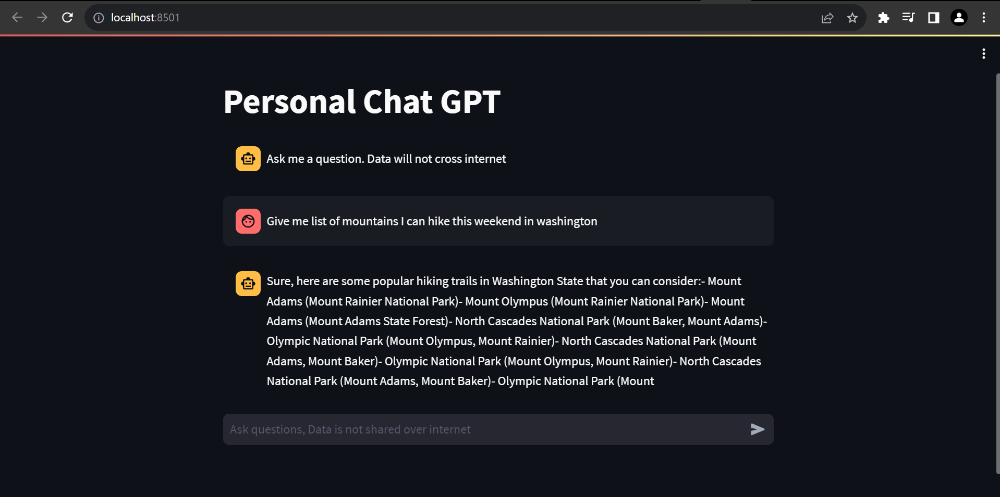

# Personal ChatGPT
## Goal 
To build a personal Chat GPT which can run on local machine without internet.

## Setup
You need internet for the initial setup.
1. Download gpt model
2. Create Python virtual env
3. Pip install all required dependency.

### Download gpt model 
Download __ggml-gpt4all-j-v1.3-groovy__ model from internet, place the model into __models__ folder of this project

### Create Virtual Environment
Creat python virtual environment, below example will create an __pgpt__ environment
```dos
PS C:\Users\mailtopk\personalgpt>python -m venv pgpt
```

### Activate Environment
Activate python virtual environment. Powershell script command.
```dos
C:\Users\mailtopk\personalgpt> .\pgpt\Scripts\Activate.ps1
```

### Install dependency
Install required dependency
```dos
C:\Users\mailtopk\personalgpt> pip install -r ./requirements.txt
```
Run the application
```dos
C:\Users\mailtopk\personalgpt>streamlit run .\main.py
```

## GUI
Application has one page and it build on Streamlit framework.

### Main Screen


### Processing Question 
This step may take few min depend on local machine memory


### Processed 
GPT response to the question

Example 1 :


Example 2:


